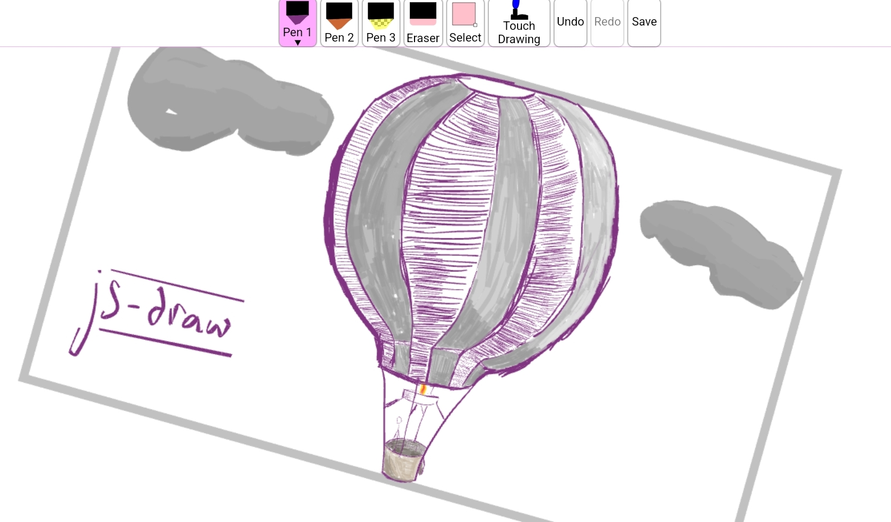

# js-draw



For example usage, see [doc/example/example.html](doc/example/example.ts).

# API

To use `js-draw`, 

## Creating an `Editor`

To create a new `Editor` and add it as a child of `document.body`,
```ts
import Editor from 'js-draw';
import 'js-draw/styles';

const editor = new Editor(document.body);
```

The `import js-draw/styles` step requires a bundler that can import `.css` files. For example, [`webpack` with `css-loader`.](https://webpack.js.org/loaders/css-loader/)


## Adding a toolbar

To create a toolbar with the default tools:
```ts
const toolbar = editor.addToolbar();
```

Custom actions can be added to the toolbar. For example, to add a `save` button:
```ts
toolbar.addActionButton('Save', () => {
    const svgElem = editor.toSVG();
    console.log('The saved SVG:', svgElem.outerHTML);
});
```

## Loading from an SVG

```ts
editor.loadFromSVG(`
    <svg
        viewBox="156 74 200 150"
        width="200" height="150"
    >
        <path d="M156,150Q190,190 209,217L213,215Q193,187 160,148M209,217Q212,218 236,178L232,176Q210,215 213,215M236,178Q240,171 307,95L305,93Q237,168 232,176M307,95Q312,90 329,78L327,74Q309,87 305,93" fill="#07a837"></path>
    </svg>
`);
```

**Note**: While `js-draw` supports a small subset of the SVG markup language, it tries to preserve unrecognised SVG elements.

For example, although `js-draw` doesn't support `<circle/>` elements,
```svg
<svg
    viewBox="156 74 200 150"
    width="200" height="150"
>
    <path d="M156,150Q190,190 209,217L213,215Q193,187 160,148M209,217Q212,218 236,178L232,176Q210,215 213,215M236,178Q240,171 307,95L305,93Q237,168 232,176M307,95Q312,90 329,78L327,74Q309,87 305,93" fill="#07a837"></path>
    <circle cx=200 cy=100 r=40 fill='red'/>
</svg>
```
renders as


but exports to 
```svg
<svg viewBox="156 74 200 150" width="200" height="150" version="1.1" baseProfile="full" xmlns="http://www.w3.org/2000/svg"><g><path d="M156,150M156,150Q190,190 209,217L213,215Q193,187 160,148M209,217M209,217Q212,218 236,178L232,176Q210,215 213,215M236,178M236,178Q240,171 307,95L305,93Q237,168 232,176M307,95M307,95Q312,90 329,78L327,74Q309,87 305,93" fill="#07a837"></path></g><circle cx="200" cy="100" r="40" fill="red"></circle></svg>
```

which **does** contain the `<circle/>` element.

